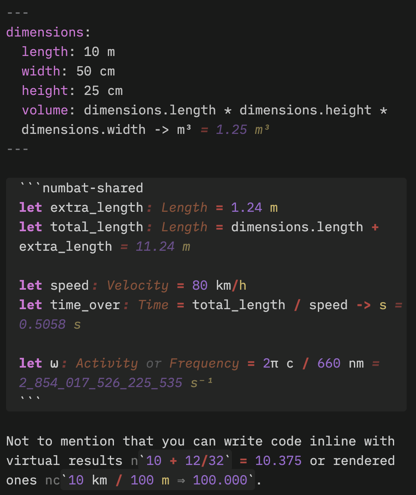

# Symbat

Symbat is a plugin for [Obsidian](https://obsidian.md) that embeds the amazing unit-aware calculator
[Numbat](https://numbat.dev) into Obsidian. Numbat gives you a statically-typed, scientific
calculator language with real physical dimensions, and this plugin wires it into your notes. You can
use it in code blocks, frontmatter properties, inline expressions, and the REPL, and it also comes
with comprehensive tooling like autocomplete, scope inspectors, and hover.

Everything **runs locally**, with the entire Numbat standard library compiled into the WebAssembly
binary. No network requests are ever made unless you opt into live currency rates. The plugin never
reads your clipboard — the one time it touches it is the **Copy debug info** button in the settings,
which writes out version numbers, your platform, and the list of plugins you have installed, so you
can paste it into a bug report.

```numbat
let power = 1.2 kW
let runtime = 3 h
power * runtime -> kWh    # 3.6 kWh
```

> **The plugin is Symbat; the language is Numbat.** You still write `numbat` blocks, `.nbt` files,
> and `numbat-use` properties. The name Symbat is for the **sym**bolic algebra layer that sits on
> the [roadmap](docs/roadmap.md).

## Key Features



_Click to learn more._

<details>
<summary>
<b>Full Numbat Support</b>
</summary>
<p></p>

[Numbat](https://numbat.dev) is an amazing scientific calculator with units support, and Symbat is
_fully compatible_ with its syntax, semantics, and type system. You can check out the official
[documentation](https://numbat.dev/docs/), as well as the
[tutorial](https://numbat.dev/docs/tutorial/) and
[syntax reference](https://numbat.dev/docs/examples/example-numbat_syntax/) for more information.

</details>

<details>
<summary>
<b>Notebook-Style Evaluation</b>
</summary>
<p></p>

You can write numbat code in code blocks inside your standard markdown notes that evaluate and
render across source mode, live preview, and reading mode. `numbat` blocks provide isolated
contexts, while `numbat-shared` blocks share state with other such blocks. Evaluation is always
replayed in order, so there are no IPython-style evaluation order concerns.

</details>

<details>
<summary>
<b>Write Expressions Inline</b>
</summary>
<p></p>

You can write numbat expressions in the middle of lines, getting live results as you type. An
expression like `` n`5 km + 3 mi` `` inlays the result as virtual text, which you can click to bake
the value into your notes. An expression like `` nc`10 cm + 3 in ...` `` computes the result
continuously into the note after a `⇒`.

</details>

<details>
<summary>
<b>Note Properties Integration</b>
</summary>
<p></p>

Note properties can be given the **Numbat** type, which turns its value into a fully-interactive
numbat expression bound into the note's scope. A property `distance: 21.1 km` makes the query
`distance -> mi` work in any Numbat scope in the note. Nested YAML objects are bound as Numbat
structs, which works very well with
[Better Properties](https://github.com/unxok/obsidian-better-properties).

</details>

<details>
<summary>
<b>Imports and Preludes</b>
</summary>
<p></p>

Symbat lets you `numbat-use` other notes in your frontmatter to import their properties and shared
blocks into your note. You can also specify custom `.nbt` files as preludes that will be loaded for
every context.

</details>

<details>
<summary>
<b>Interactive Evaluation</b>
</summary>
<p></p>

Symbat highlights results, errors, and hints inline as you type as inlay hints. You get a truly
interactive notebook experience, no matter where you are evaluating Numbat code: it works in
properties, inline expressions, blocks, and even [Bases](https://obsidian.md/help/bases) cells.
Symbat also comes with a REPL that lives in the sidebar, with history, live highlighting, and
Numbat's built-in interactive commands.

</details>

<details>
<summary>
<b>Unicode Completions</b>
</summary>
<p></p>

Math tends to make heavy use of unicode symbols, so Symbat has integrated Numbat's unicode completer
to make typing such things far easier. `\alpha` → `α`, `\pi` → `π`, `\_2` → `₂` as you type, without
any need to think, and it even plays nicely with
[Typing Transformer](https://github.com/aptend/typing-transformer-obsidian) and
[Shiki](https://github.com/mProjectsCode/obsidian-shiki-plugin).

</details>

<details>
<summary>
<b>Built for Power Users</b>
</summary>
<p></p>

Not just a Numbat notebook, Symbat integrates a whole host of features for the power user. There is
completion for identifiers, keywords, units, dimensions, and types, with signature and documentation
help shown clearly, and that works in every context where you can write Numbat code. There is
comprehensive hover support, showing information for a symbol you point the mouse at or rest the
caret on. Syntax highlighting works in every Numbat expression, providing rich semantic highlighting
as you work.

This is accompanied by a notebook scope inspector, which shows every binding that the note contains,
allowing you to see its current value and click through to its definition. It has a search box that
both searches the note scope and lets you browse the bundled prelude. Symbat also includes an
editing mode for `.nbt` files in Obsidian, allowing you to work with Numbat files natively with all
of these power-user tools.

</details>

<details>
<summary>
<b>Learn More</b>
</summary>
<p></p>

For full details on every feature, including the settings that govern their behavior, take a look at
the [feature reference](docs/features.md).

</details>

<p>&nbsp;</p>
<p>&nbsp;</p>
<p>&nbsp;</p>
<p>&nbsp;</p>

## Installation

Symbat is most easily installed via its [listing](https://community.obsidian.md/plugins/symbat) on
the Community Plugins Directory.

If you want to install pre-release versions, we recommend using
[BRAT](https://community.obsidian.md/plugins/obsidian42-brat). You can also install them yourself as
follows:

1. Download `main.js`, `manifest.json`, and `styles.css` from the
   [latest release](https://github.com/iamrecursion/symbat/releases/latest).
2. Create `<vault>/.obsidian/plugins/symbat/` and put all three files in it.
3. Reload Obsidian, then enable **Symbat** under **Settings → Community plugins**.

> **Symbat requires Obsidian 1.13.0 or newer** as it relies on some newer parts of the Obsidian API.

## Basic Usage

Beyond the features described [above](#key-features), Symbat provides a number of commands to make
it easier to work with the plugin's features:

- **Open REPL** — also on the ribbon (calculator icon).
- **Open note scope inspector** — also on the ribbon (list icon).
- **Search the note scope and prelude** — focuses the inspector's search box.
- **Show info at the cursor** — opens the hover card on demand, and says why when there is nothing
  to show.
- **Commit all visible inline evaluations** — bakes every on-screen `` n`…` `` result into the text.
- **Create a `.nbt` file** — Obsidian's "New note" only ever makes Markdown.

The settings in **Settings → Symbat** let you customize the behavior of Symbat. It may seem a bit
sparse at first, but most settings are hidden by the master toggles for their corresponding
features. Have a play!

## Documentation

If you are interested in contributing to Symbat, or simply just building the codebase yourself,
please check out our [CONTRIBUTING](docs/CONTRIBUTING.md) documentation.

For more information on Numbat, the fantastic unit-aware calculator that makes this plugin possible,
take a look at:

- The [Numbat Home Page](https://numbat.dev), providing key links for learning about Numbat and also
  an interactive REPL (the same WebAssembly code this plugin is built on).
- The [documentation](https://numbat.dev/docs) which provides a comprehensive overview of the Numbat
  language, its features, and even a [tutorial](https://numbat.dev/docs/tutorial/) to get you
  started.
- The [syntax reference](https://numbat.dev/docs/examples/example-numbat_syntax/), which describes
  exactly how Numbat's syntax works.

For more information on Symbat, you can additionally take a look at the following:

- The [feature reference](docs/features.md), which provides a detailed overview of each plugin
  feature and the settings that configure it.
- The [architecture doc](docs/architecture.md), which describes the various modules that make up the
  plugin, and how we handle the state of the interpreter.
- The [plugin roadmap](docs/roadmap.md), which describes the planned features and forward-looking
  evolution of the plugin.
- The design notes, which work through the two large planned features —
  [symbolic computation](docs/design/cas.md) and [graphing](docs/design/graphing.md) — and
  [what a soft fork of Numbat would buy today](docs/design/soft-fork.md), which is where all three
  of them converge.

## Credits

This plugin literally **would not exist** without the incredible [Numbat](https://numbat.dev) that
it is built on top of. Numbat is by David Peter and its other
[contributors](https://github.com/sharkdp/numbat/graphs/contributors), and is dual-licensed under
[Apache-2.0](https://github.com/sharkdp/numbat/blob/main/LICENSE-APACHE) and
[MIT](https://github.com/sharkdp/numbat/blob/main/LICENSE-MIT).

This plugin is [MIT-licensed](./LICENSE).
